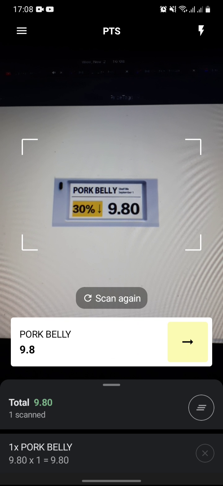

<h1 align="center"> OCR Price Tag Scanner </h1>

  Price Tag Scanner app built using Kotlin, Jetpack Compose, <a href="https://developers.google.com/ml-kit" target="_blank">MLKit</a> and <a href="https://opencv.org/android/" target="_blank">OpenCV4 SDK</a>.

  

## Introduction

This is an open source application for extracting information such as price and product names from price tags on store shelves and calculating grocery bill totals.

  
  

## Using Price Tag Scanner
### 1. Add OpenCV module dependencies
* <a href="https://opencv.org/android/" target="_blank">OpenCV4 Android SDK</a>
* <a href="https://medium.com/kouosl/opencv-4-2-0-set-up-for-c-in-android-studio-dc88b0bb34b2" target="_blank"> OpenCV JNILibs</a>
### 2. Sync project with Android Studio

